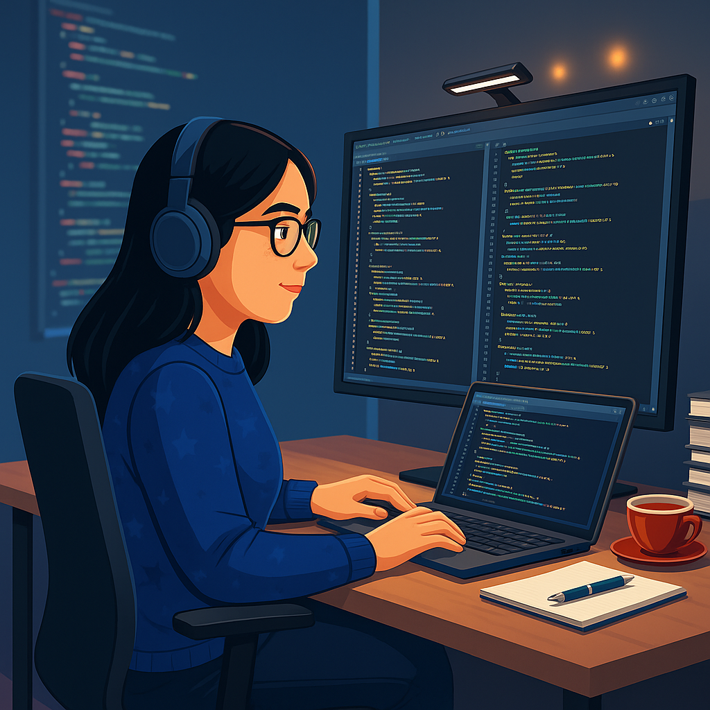

<table>
  <tr>
    <td>
      
    </td>
    <td>
      <h3>Sobre mim</h3>
      Olá! Sou <strong>Kelly Alves Robson</strong>, desenvolvedora Full Stack e formada em Cibersegurança. 
      Construo soluções digitais completas — do backend seguro ao frontend otimizado — com foco em performance e escalabilidade. 
      Atualmente estudando <strong>DevOps e Integração Contínua</strong>. 
      Áreas de interesse: <strong>Segurança da Informação, Desenvolvimento Backend, APIs REST e Otimização de Performance</strong>. 
      💡 Curiosidade: Gosto de resolver desafios de segurança e explorar vulnerabilidades de forma ética (pentest). 
      <strong>Fique à vontade para explorar meus projetos, conectar-se ou colaborar!</strong>
    </td>
  </tr>
</table>

### 🌟 Habilidades Técnicas

  <!-- Backend & Segurança -->
  
  
  
  
  
   
  <!-- Frontend -->
  
  
  
  
  
   
  <!-- Ferramentas e DevOps -->
  
  
  

### 🚀 Projetos Destacados

| Projeto | Descrição | Tecnologias |
|--------|------------|-------------|
| [Portfólio Pessoal](https://kellycodes-create.vercel.app/) | Meu portfólio online com links para projetos e contato | Next.js, Tailwind CSS |
| API REST Segura | API com autenticação JWT e proteção contra ataques comuns | Node.js, Express, PostgreSQL |
| Task Manager | Aplicativo de gerenciamento de tarefas com autenticação e backend seguro | React, Node.js, SQLite |

### 🌐 Conecte-se comigo

  
  
  

